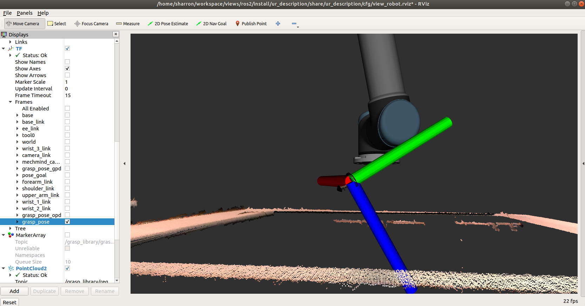

# ROS2 Grasp Library

A ROS2 intelligent visual grasp solution for advanced industrial usages, enabling acceleration for state-of-the-art algorithms such as [OpenVINO™](https://docs.openvinotoolkit.org/) accelerated deep-learning-based grasp detection and [oneAPI](https://www.oneapi.com/) accelerated traditional 3D object pose detection, with [ROS2](https://docs.ros.org) and [MoveIt](http://moveit.ros.org) supports.

## Overview
ROS2 Grasp Library enables state-of-the-art detection algorithms, both deep learning based grasp pose detection and traditional 3D object pose detection, for intelligent visual grasp in industrial robot usage scenarios. This package provides ROS2 interfaces compliant with the open source MoveIt motion planning framework supported by most of the robot models in ROS industrial. This package delivers
* A ROS2 Grasp Planner providing grasp planning service, as an extensible capability of MoveIt moveit_msgs::srv::GraspPlanning, translating grasp detection results into MoveIt Interfaces moveit_msgs::msg::Grasp
* A ROS2 Grasp Detctor abstracting interfaces for grasp detection results
* A ROS2 hand-eye calibration module generating transformation from camera frame to robot frame
* ROS2 example applications demonstrating how to use this ROS2 Grasp Library in advanced industrial usages for intelligent visual grasp

## Grasp Detection Algorithms
Grasp detection back-end algorithms enabled by this ROS2 Grasp Library:

- [3D Object Pose Detection](https://pointclouds.org/documentation/group__registration.html) detects 6-DOF object poses and translates into grasp poses in 3D point clouds. The 3D object pose detection was enabled with Intel® [oneAPI](https://www.oneapi.com/) toolkit to deploy the execution on heterogeneous accelerator devices with parallel computing units.

  

- [Grasp Pose Detection](https://github.com/atenpas/gpd) detects 6-DOF grasp poses for a 2-finger grasp (e.g. a parallel jaw gripper) in 3D point clouds from RGBD sensor or PCD file. The grasp detection was enabled with Intel® [OpenVINO™](https://docs.openvinotoolkit.org/) toolkit.

  

## Tutorials
Refer to ROS2 Grasp Library [Tutorials](http://intel.github.io/ros2_grasp_library) for how to
* Install, build, and launch the ROS2 Grasp Planner and Detector
* Use launch options to customize in a new workspace
* Bring up the intelligent visual grasp solution on a new robot
* Do hand-eye calibration for a new camera setup
* Launch the example applications

## Contribute to This Project
  It's welcomed to contribute to this project. Here're some recommended practices:
  * When adding a new feature it's expected to add tests covering the new functionalities
    ```bash
    colcon test --packages-select <names_of_affected_packages>
    ```
  * Before submitting a patch, it's recommended to pass all existing tests to avoid regression
    ```bash
    colcon test --packages-select <names_of_existing_packages>
    ```

###### *Any security issue should be reported using process at https://01.org/security*
