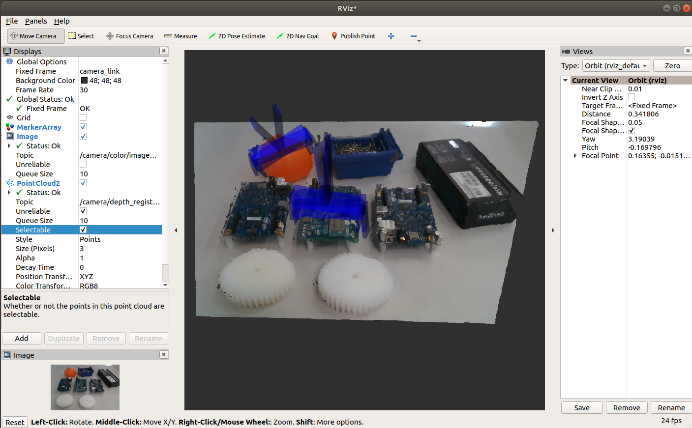

# ROS2 Grasp Library

## Overview
ROS2 Grasp Library enables state-of-the-art CNN based deep learning grasp detection algorithms on ROS2 for visual based industrial robot manipulation. This package provide ROS2 interfaces compliant with the [MoveIt!](http://moveit.ros.org/) motion planning framework which is supported by most of the [robot models](https://moveit.ros.org/robots) in ROS industrial.

In addition to enabling the grasp detection algorithms, this package also deliver
* A Grasp Planner as an extensible capability of MoveIt, providing ROS2 grasp planning service.
* Grasp transformation from camera frame to a specified target frame given the TF available, e.g. 'base' frame expected in the visual manipulation.
* Grasp translation to the MoveIt Interfaces ([moveit_msgs::srv::GraspPlanning](http://docs.ros.org/api/moveit_msgs/html/srv/GraspPlanning.html)).
* A 'service-driven' grasp detection mechanism to minimize CPU load for real-time processing.

The back-end grasp detection algorithms enabled:
- [Grasp Pose Detection](https://github.com/atenpas/gpd) detects 6-DOF grasp poses for a 2-finger grasp (e.g. a parallel jaw gripper) in 3D point clouds from RGBD sensor or PCD file. The grasp detection workloads are accelerated with Intel [OpenVINO™](https://software.intel.com/en-us/openvino-toolkit) toolkit for deployment across various Intel vision devices CPU, GPU, Movidius VPU, and FPGA.

  

## ROS2 Interfaces
### Subscribed Topics
  * /camera/depth_registered/points ([sensor_msgs::msg::PointCloud2](https://github.com/ros2/common_interfaces/blob/master/sensor_msgs/msg/PointCloud2.msg)), PointCloud2 messages from RGBD camera

### Published Topics
ROS2 topic conveys grasp detection results, used by non-MoveIt manipulation applications
  * /grasp_library/clustered_grasps ([grasp_msgs::msg::GraspConfigList](https://github.com/intel/ros2_grasp_library/blob/master/grasp_msgs/msg/GraspConfigList.msg)), detected grasps from GPD

### Delivered Services
ROS2 grasp planning service as MoveIt plugin, used by MoveIt manipulation applications
  * plan_grasps ([moveit_msgs::srv::GraspPlanning](http://docs.ros.org/api/moveit_msgs/html/srv/GraspPlanning.html)), MoveIt! grasp planning service

The above interfaces can be bridged back to ROS via [ros1_bridge](https://github.com/ros2/ros1_bridge/blob/master/README.md)

## Tutorials
* [Grasp Library with RGBD Camera](docs/tutorials_1_grasp_library_with_camera.md)
* [Grasp Library Test](docs/tutorials_2_grasp_library_test.md)

## Known Issues
  * Cloud camera failed at "Invalid sizes when resizing a matrix or array" when dealing with XYZRGBA pointcloud from ROS2 Realsenes, tracked as [#6](https://github.com/atenpas/gpg/issues/6) of gpg, [patch](https://github.com/atenpas/gpg/pull/7) under review.
  * 'colcon test' sometimes failed with test suite "tgrasp_library", due to ROS2 service request failure issue (reported ros2 examples issue [#228](https://github.com/ros2/examples/issues/228) and detailed discussed in ros2 demo issue [#304](https://github.com/ros2/demos/issues/304))

## Contribute to This Project
  It's welcomed to contribute to this project. Here're some recommended practices:
  * When adding a new feature it's expected to add tests covering the new functionalities.
  * Before submitting a patch, it's recommended to pass all existing tests to avoid regression. See above section [Grasp Library Test](docs/tutorials_2_grasp_library_test.md)

###### *Any security issue should be reported using process at https://01.org/security*
