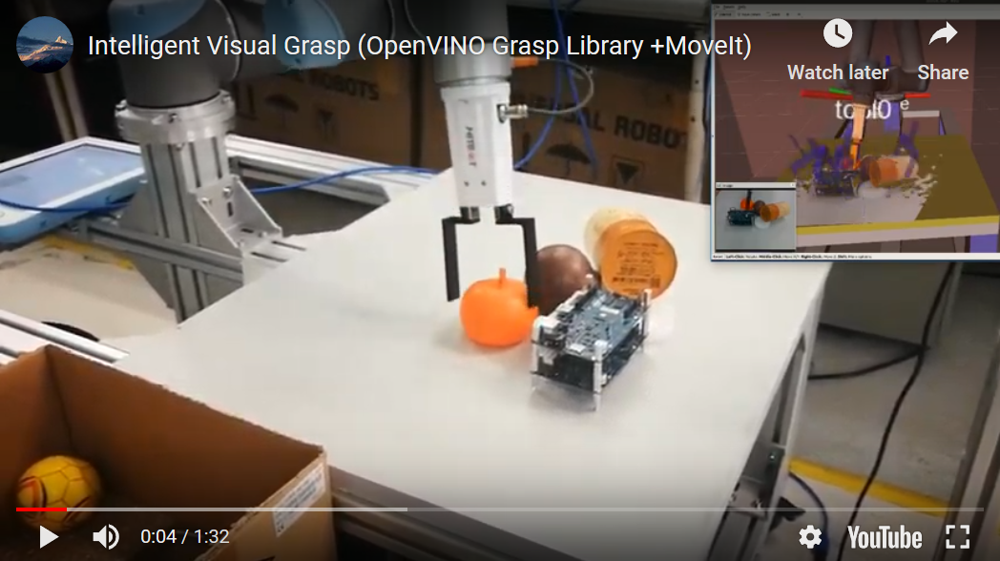
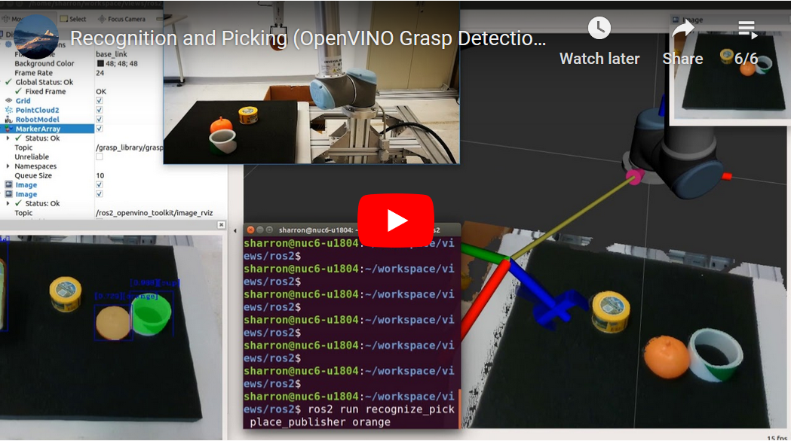

Contact: webadmin@linux.intel.com
# ROS2 Grasp Library

A ROS2 intelligent visual grasp solution for advanced industrial usages, with OpenVINO™ grasp detection and MoveIt Grasp Planning.

## Overview
ROS2 Grasp Library enables state-of-the-art CNN based deep learning grasp detection algorithms on ROS2 for intelligent visual grasp in industrial robot usage scenarios. This package provides ROS2 interfaces compliant with the open source [MoveIt](http://moveit.ros.org/) motion planning framework supported by most of the [robot models](https://moveit.ros.org/robots) in ROS industrial. This package delivers
* A ROS2 Grasp Planner providing grasp planning service, as an extensible capability of MoveIt ([moveit_msgs::srv::GraspPlanning](http://docs.ros.org/api/moveit_msgs/html/srv/GraspPlanning.html)), translating grasp detection results into MoveIt Interfaces ([moveit_msgs::msg::Grasp](http://docs.ros.org/api/moveit_msgs/html/msg/Grasp.html))
* A ROS2 Grasp Detctor abstracting interfaces for grasp detection results
* A ROS2 hand-eye calibration module generating transformation from camera frame to robot frame
* ROS2 example applications demonstrating how to use this ROS2 Grasp Library in advanced industrial usages for intelligent visual grasp

## Grasp Detection Algorithms
Grasp detection back-end algorithms enabled by this ROS2 Grasp Library:
- [Grasp Pose Detection](https://github.com/atenpas/gpd) detects 6-DOF grasp poses for a 2-finger grasp (e.g. a parallel jaw gripper) in 3D point clouds from RGBD sensor or PCD file. The grasp detection was enabled with Intel® [DLDT](https://github.com/opencv/dldt) toolkit and Intel® [OpenVINO™](https://software.intel.com/en-us/openvino-toolkit) toolkit.

  

## Tutorials
Refer to ROS2 Grasp Library [Tutorials](http://intel.github.io/ros2_grasp_library) for how to
* Install, build, and launch the ROS2 Grasp Planner and Detector
* Use launch options to customize in a new workspace
* Bring up the intelligent visual grasp solution on a new robot
* Do hand-eye calibration for a new camera setup
* Launch the example applications

## Example Applications

### Random Picking (OpenVINO Grasp Detection)

[](https://www.youtube.com/embed/b4EPvHdidOA)

### Recognition Picking (OpenVINO Grasp Detection + OpenVINO Mask-rcnn Object Segmentation)

[](https://www.youtube.com/embed/trIt0uKRXBs)

## Known Issues
  * Cloud camera failed at "Invalid sizes when resizing a matrix or array" when dealing with XYZRGBA pointcloud from ROS2 Realsenes, tracked as [#6](https://github.com/atenpas/gpg/issues/6) of gpg, [patch](https://github.com/atenpas/gpg/pull/7) under review.
  * 'colcon test' sometimes failed with test suite "tgrasp_ros2", due to ROS2 service request failure issue (reported ros2 examples issue [#228](https://github.com/ros2/examples/issues/228) and detailed discussed in ros2 demo issue [#304](https://github.com/ros2/demos/issues/304))
  * Rviz2 failed to receive Static TF from camera due to transient_local QoS (expected in the coming ROS2 Eloquent, discussed in geometry2 issue [#183](https://github.com/ros2/geometry2/issues/183)), workaround [patch](https://github.com/intel/ros2_intel_realsense/pull/88) available till the adaption to Eloquent

## Contribute to This Project
  It's welcomed to contribute to this project. Here're some recommended practices:
  * When adding a new feature it's expected to add tests covering the new functionalities
    ```bash
    colcon test --packages-select <names_of_affected_packages>
    ```
  * Before submitting a patch, it's recommended to pass all existing tests to avoid regression
    ```bash
    colcon test --packages-select <names_of_existing_packages>
    ```

###### *Any security issue should be reported using process at https://01.org/security*
