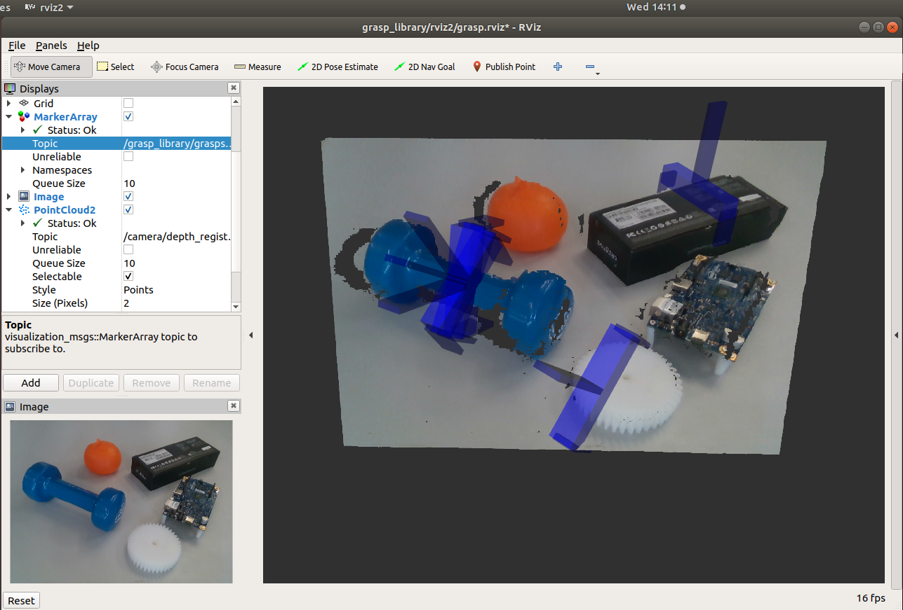

Getting Start
=============

This tutorial introduces getting start to use this ROS2 Grasp Library.

.. _GraspPlanning: http://docs.ros.org/api/moveit_msgs/html/srv/GraspPlanning.html
.. _GPD: https://github.com/atenpas/gpd
.. _OpenVINO™: https://software.intel.com/en-us/openvino-toolkit
.. _Grasp: http://docs.ros.org/api/moveit_msgs/html/msg/Grasp.html

ROS2 Grasp Planner and Detector
-------------------------------

In this section, you will start with an RGBD sensor connecting to a Ubuntu host machine.

The grasp detection relys on OpenVINO™ toolkit. Follow this `grasp_planner <grasp_planner.html>`_ instruction to install the toolkit, then build and install the ROS2 Grasp Planner and Detector with your camera.

After launch the grasp planner, from rviz you will see grasp detection results highlighted as blue markers.

Use Launch Options for Customization
------------------------------------

ROS2 parameters are supported to customize the Grasp Detector and Grasp Planner for your local workspace. For example, the topic name of point cloud from RGBD sensor, the camera workspace (in the frame_id of the point cloud image), the grasp approach direction and angle, the grasp boundary (in the frame_id of the robot base).

Robot Interface
---------------

In this section, you will bring up your robot by implementing the Robot Interface. Currently the robot interface is defined in C++, python vesion is still working in progress.

Robot Interface are the minimum APIs a robot should provide to enable this solution. Follow this `robot_interface <bringup_robot.html>`_ insturction to implement the required `move`, `open`, `close`, `startLoop` interfaces.

Then make sure your implementation passed the Robot Interface tests, to garantee later integration with the example applications. Also you may try the "Robot Control Applications" (like Draw X, fixed position pick and place) to verify your implemntation working well.

Hand-eye Calibration
--------------------

Now start to generate transformation between the camera and the robot. Follow this `handeye_calibration <handeye_calibration.html>`_ insturtion to finish the procedure of hand-eye calibration. The calibration procedure need to be done at the time when camera is setup. The resulting transformation will be remembered in your local environment for later publishing when launching the applications.

Launch Intelligent Visual Grasp Applications
--------------------------------------------

To this step, you may start to launch the applications.

`Random Picking <random_pick.html>`_ runs OpenVINO grasp detection on GPU, and sends request to ROS2 MoveIt Grasp Planner for grasp planning and detection. The most likely successful grasps are returned by the Grasp Pose Detection from CNN inference, taking 3D point cloud inputs from the camera. The picking order is not pre-defined, so called random picking.

`Recognition Picking <recognize_pick.html>`_ runs OpenVINO grasp detection on GPU, and runs OpenVINO object segmentation on CPU or Movidius VPU. The masks of recognized objects are returned from the `mask_rcnn` model. The `place_publisher` publishing the name of the object to pick and the position to place, so called recognition picking.
