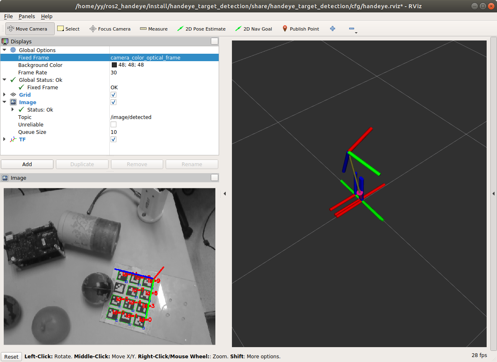
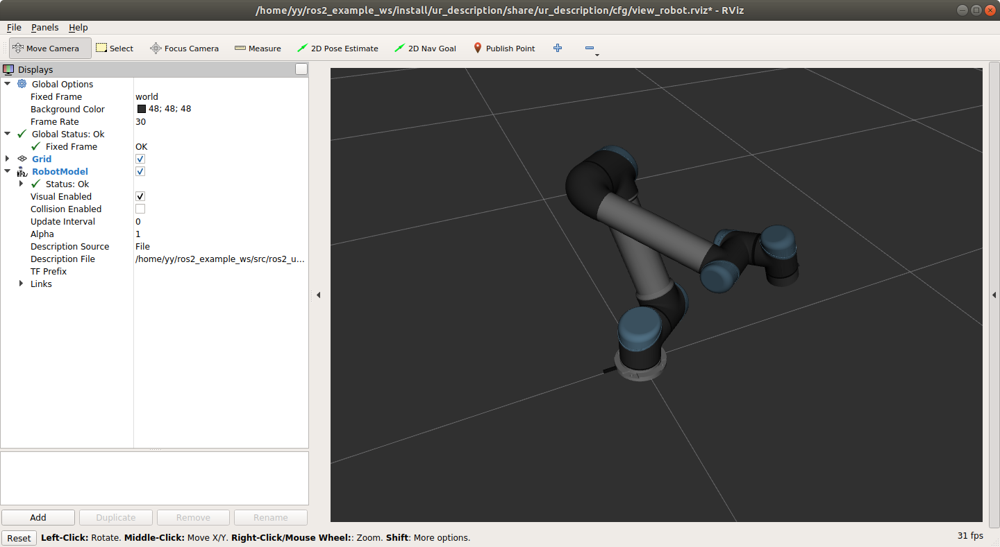
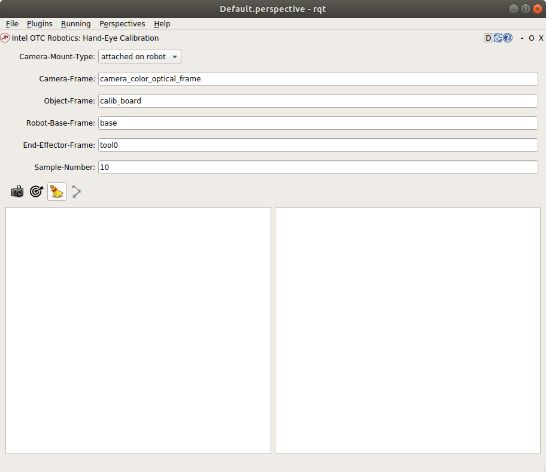
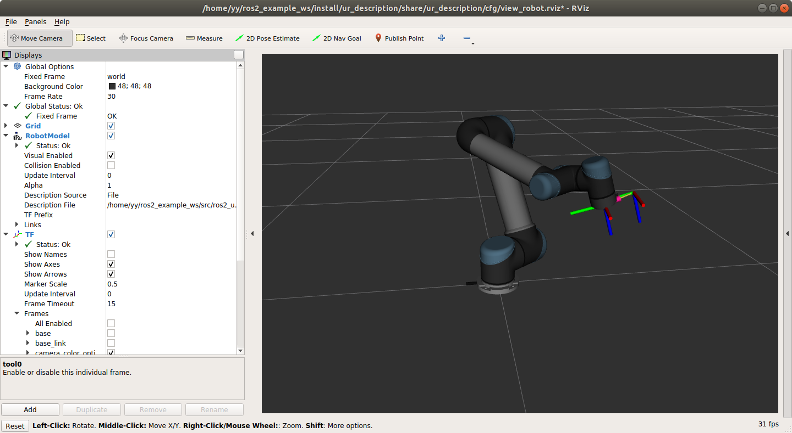

# handeye_dashboard

## 1.Prerequisite

* System install
  * Install [ROS2 Dashing](https://index.ros.org/doc/ros2/Installation/Dashing/Linux-Install-Debians/)
* Install [handeye](https://github.com/RoboticsYY/handeye)
* Install [criutils](https://github.com/RoboticsYY/criutils)
* Install [baldor](https://github.com/RoboticsYY/baldor)
* Install [handeye_tf_service](https://github.com/intel/ros2_grasp_library/tree/master/grasp_utils/handeye_tf_service)
* Install [handeye_target_detection](https://github.com/intel/ros2_grasp_library/tree/master/grasp_utils/handeye_target_detection)

## 2. Build and install

```shell
sudo apt install python3-numpy python3-scipy
```

Build with the `ros2_grasp_library` package. Installation instructions refer to [here](https://github.com/intel/ros2_grasp_library/blob/master/grasp_tutorials/doc/grasp_ros2/tutorials_1_grasp_ros2_with_camera.md).

## 3.Run

### 3.1 Bring up realsense camera

```shell
ros2 run realsense_node realsense_node __params:=`ros2 pkg prefix realsense_examples`/share/realsense_examples/config/d435.yaml
```

> Note: other cameras can be used, only need to check that the image topic and camera info topic are published

### 3.2 Bring up calibration board detection

```shell
ros2 launch handeye_target_detection pose_estimation.launch.py
```

For detailed information, please refer to the package [handeye_target_detection](https://github.com/intel/ros2_grasp_library/tree/master/grasp_utils/handeye_target_detection)

If runing successfully, you should see something similar to: 



The detection result is displayed on the left panel of the Rviz2.

### 3.3 Bring up UR5 robot

```shell
# Terminal 1 (robot frames tf update)
ros2 launch robot_interface ur_test.launch.py move:=false

# Terminal 2 (robot state display in Rviz2)
ros2 launch ur_description view_ur5_ros2.launch.py
```

The realtime robot state is displayed:



> Note: any robot can be used, only ensure that the robot ROS2 driver is publishing the joint states and link TFs at rate of at least 125Hz

### 3.4 Bring up calibration dashboard

```shell
ros2 launch handeye_dashboard handeye_dashboard.launch.py
```

If running successfully, a rqt dashboard similar to the below photo should show up:


On the panel of the dashboard, user can input the names of `Camera-Frame`, `Object-Frame`, `Robot-Base-Frame` and `End-Effector-Frame`. The calibration will lookup the TF transforms:

* From `Camera-Frame` to `Object-Frame` 
* From `Robot-Base-Frame` to `End-Effector-Frame`

The calibration process is controlled by the four buttons on the left panel of the dashboard:

* Step 0: Select camera mount type, `attached on robot` or `fixed beside robot`.
* Step 1: Use the first button to take snapshots of the two transforms.
* Step 2: After enough samples are taken, use the second button to save the snapshots and make the AX=XB calculation.
* Step 3: Use the fourth button to publish the static TF transform between `Camera-Frame` and `Robot-Base-Frame`. Please check TF or point cloud on Rviz2 to make sure the camera pose published.

> Note: Be careful with the third button, it is used to clear the snapshots and the calculation result.

### 3.5 Publish calibration result

Please check the result at `/tmp/camera-robot.txt`:

```yaml
camera-robot pose:
  Translation: [-0.032727495589941216, -0.09304065368400717, 0.0003508296697299189]
  Rotation: in Quaternion [0.9997471812284859, 0.01090594636560865, -0.009141740972837598, -0.0174086912647742]
```

The result can be published without launching the whole GUI on command line:

```shell
#ros2 run tf2_ros static_transform_publisher <Translation x, y, z> <Rotation x, y, z, w> <from_frame> <to_frame>
# NOTE the quaternion stored in "camera_robot.txt" is <w, x, y, z>

ros2 run tf2_ros static_transform_publisher -0.032727495589941216, -0.09304065368400717, 0.0003508296697299189 0.01090594636560865, -0.009141740972837598, -0.0174086912647742, 0.9997471812284859 base camera_link
```

## 4.Result

A result with the camera mounted on the robot end-effector looks like this:



A video of the calibration process can be found at:
[handeye_calibration_demo](https://videoportal.intel.com/media/Industrial-robot-hand-eye-calibration/0_8ddlp0p1)

###### *Any security issue should be reported using process at https://01.org/security*
